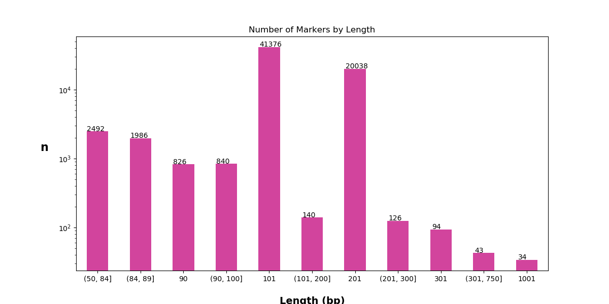
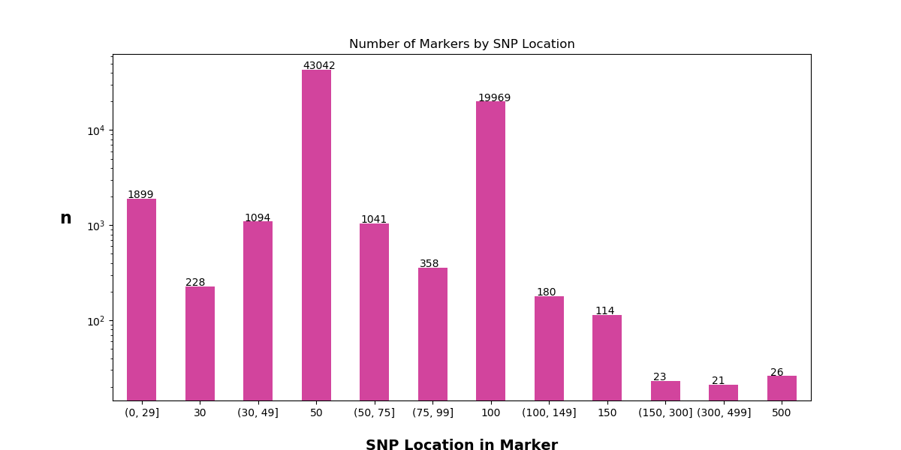
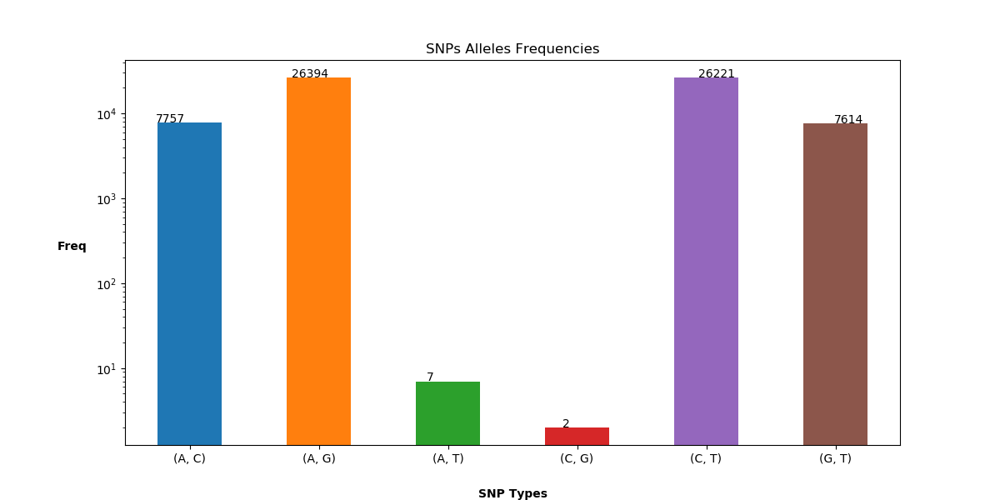

# ***Question 1 - Array Design***
# Part1
 The requested csv result file can be found [here](output/part1/marker_data.csv).   
 
 Part1 script produce two additional files:  
 - [Excluded markers (txt)](output/part1/excluded_sequences.txt) - List of problems detected in each marker.  
 - [Excluded markers names (csv)](output/part1/error_markers_names.csv) - Description line of all excluded markers.

# Part 2

## Output files:
 - [allele 1 marker sequences (fasta)](output/part2/allele_1_sequences.fasta).
  - [allele 2 marker sequences (fasta)](output/part2/allele_2_sequences.fasta).

# Part 3

### Markers Length

Two predominant values cover **99.57%** of all markers.

###### Top 10 value counts:  
###### Missing Data Fraction | Marker Count
<pre>
101                                            41376
201                                            20038
90                                             826
88                                             783
87                                             384
89                                             346
86                                             238
85                                             235
61                                             218
63                                             185
</pre>

**Mean:130.065, Median:101.0**

Binned bar plot with customized bins to emphasize the predominant values:

### Position of SNP in marker sequence.

Two predominant SNP position values cover **99.57%** of all markers.  

**Mean:64.55, Median:50.0**  
Binned bar plot with customized bins to emphasize the predominant values:  
   

### Frequencies of SNP types

## Other Statistics

### Relation between Marker Length and SNP location on marker

Due to the fact that both variables hold 2 predominant values I decided  
to subset the data based on those values instead of checking correlation  
between the variables.

#### Marker Length set to 101:

###### Top 10 value counts:  
###### SNP Position | Marker Count
<pre>
50                                41314
37                                5
63                                3
66                                3
57                                3
85                                2
21                                2
48                                2
49                                2
70                                2
</pre>

#### Marker Length set to 201:

###### Top 10 value counts:  
###### SNP Position | Marker Count
<pre>
100                               19969
101                               69
</pre>

### Relation between SNP types frequencies and Marker Length

