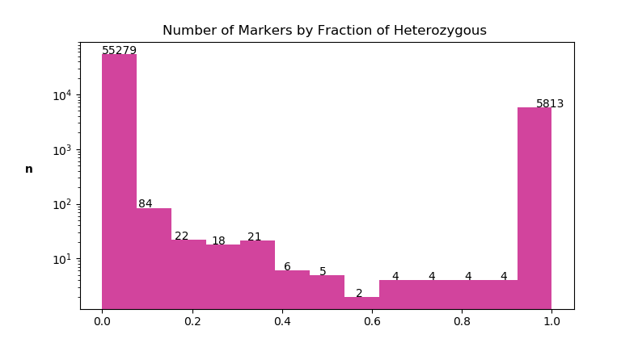

# ***Question 2 - Genotyping Data***
# Part1
 The requested csv result file can be found [here](output/part1/samples_part1_genotyping_result.csv)  
 Part1 script produce two additional files:  
 - [Discarded genotypes (csv)](output/part1/failed_genotypings.csv) - list of discarded genotypes.
 - [Discarded markers (csv)](output/part1/excluded_markers_from_question1_in_samples_file.csv) - Discard markers from question1 script that were found on   
 Question 2 part 2 xslx file. The flag: DELETE_BAD_MARKERS_BASED_ON_PART1  
  in file part2/hardcoded_variables.py allow the user to disable the removal of the markers.
 
 
# Part 2

The file part2/hardcoded_variable.py hold the filter variables, controlling the cutoffs  
 of markers and samples by fraction of missing data and by fraction of heterozygous.
 

## Output files:
 - [List of excluded markers (csv)](output/part2/filtered_markers.csv) - Holds the Missing Data Fraction and Heterozygous genotypes  
  Fraction per Marker
 - [Excluded markers sequences (fasta)](output/part1/filterd_markers.fasta)
  - [List of Excluded samples (csv)](output/part1/filterd_markers.fasta) - List of excluded samples with the Fraction of markers successfully  
   genotyped, Fraction of heterozygous genotypes and the missing data (successfully genotype complementary value)

 

## Samples
### Fraction of Missing Data by Sample

Group of 17 samples with exceptionally high Missing data **(Fraction >= 0.25)** in comparision  
to other samples should be removed.
The next 8 samples with Fraction of missing data > 0.15 are candidates for removal as well,
since the vast majority of samples missing data fraction is smaller than 0.14.  
**The cutoff value for missing data fraction by sample was set to > 0.15.**

##### Value counts divided to 10 bins (bins sorted by count): 

###### Missing data fraction bin | Samples Count
<pre>
- (0.124, 0.148]                          369
- (0.328, 0.351]                            7
- (0.261, 0.283]                            7
- (0.148, 0.17]                              6
- (0.306, 0.328]                            2
- (0.17, 0.193]                              2
- (0.283, 0.306]                            1
- (0.193, 0.215]                            1
- (0.238, 0.261]                            0
- (0.215, 0.238]                            0
</pre>
Mean:0.136, Median:0.126

### Fraction of Heterozygous genotypes by Sample
One sample, 'AH-103',with very high heterozygous genotypes (fraction = 0.39)  
 compared to all other samples and should be removed.  
 **The cutoff value for Heterozygous genotypes fraction by sample was set to > 0.35.** 
 

## Markers
### Fraction of Missing Data by Marker

#### Top 10 Value counts:
As the top 10 value counts shows, there are 7662 markers with exactly  
 100% missing data. I have found problems in the markers fasta  
 file (from question 1) annotations and sequences that might have cause  
 this markers failings, as detailed inn question 1 markers error output file.  
 This 7662 markers will be removed from the analysis at this point.  

##### Top 10 value counts:  
##### Missing Data Fraction | Marker Count
<pre>
- 0.000                             18686  
- 1.000                             7662  
- 0.003                             5873
- 0.020                             4057
- 0.023                             4049
- 0.005                             3682
- 0.008                             2346
- 0.025                             2045
- 0.018                             1783
- 0.010                             1502
</pre>

##### Value counts divided to 10 bins (bins sorted by count): 

In addition, 25 more markers were found with fraction of missing data > 0.3   
and another 17 samples with fraction of missing data > 0.2

This 25 + 17 = 42 markers should be excluded as well, Due to their small number  
and high fraction of missing data in comparision to the vast majority of all  
 other valid markers (53k+ markers with < 0.1 missing data).   
 
 **The cutoff value for missing data fraction by marker was set to > 0.199.** 
  

###### Missing data fraction bin | Marker Count
<pre>
(-0.002, 0.1]                                      53434
(0.9, 1.0]                                            7677
(0.1, 0.2]                                            113
(0.2, 0.3]                                             17
(0.3, 0.4]                                              9
(0.4, 0.5]                                              6
(0.5, 0.6]                                              5
(0.6, 0.7]                                              3
(0.8, 0.9]                                              1
(0.7, 0.8]                                              1
</pre>
Mean:0.136, Median:0.01  

### Fraction of Heterozygous reads by Marker
Group of ~5900 markers with exceptional number of Heterozygous reads   
as shown in the binned value counts and histogram.

<pre>
Heterozygous fraction bin | Markers Count
(-0.002, 0.1]                              55325
(0.9, 1.0]                                     5815
(0.1, 0.2]                                       49
(0.2, 0.3]                                       28
(0.3, 0.4]                                       23
(0.4, 0.5]                                        9
(0.7, 0.8]                                        6
(0.6, 0.7]                                        5
(0.8, 0.9]                                        4
(0.5, 0.6]                                        2
</pre>

# Part 3

  
***Please Note: part 3 does not have its own driver file, it can be run from
part2 driver last comment out lines.***

My implantation of the similarity matrix is working only on a smaller dataset  
of genotypes data due to memory problems caused by either my machine  
limitations or code efficiency. The implementation can be found  
at question2/part3/sim_matrix.py  
 
Example output on a smaller dataset can be found [here](question2/output/part3/sim_matrix.csv)
 
My idea was to create a new dataframe with the combination of every 2 samples  
as a column, and Each row represent one marker as in the original csv input  
data file.
 
Each cell in the new dataframe will be filled with 1 if both of the samples  
represented by the column have a valid nucleotide read on the marker  
represented by the row.

Lastly, the result similarity matrix is created after summing up the  
occurrences of 1's in each column - that's the number of shared markers  
between the two samples represented by the column.
 
